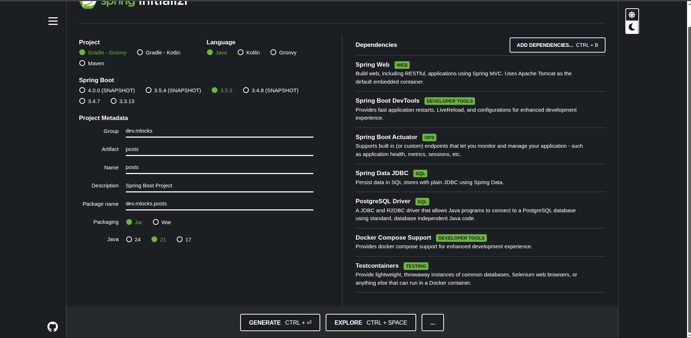

# Spring Boot Project $${\color{red}[in \space progress]}$$

This is a Simple CRUD Rest API project. The initial code is based on the tutorial from [Dan Vega](https://www.youtube.com/@DanVega) called [**Test Driven Development (TDD) in Spring**](https://youtube.com/watch?v=-H5sud1-K5A).
Along the time I will make my own modifications and improvements (i.e, add new features).


## Project File Structure

```
.
├── build.gradle
├── compose.yaml
├── Dockerfile
├── gradle
│   └── wrapper
│       ├── gradle-wrapper.jar
│       └── gradle-wrapper.properties
├── gradlew
├── gradlew.bat
├── LICENSE
├── README.md
├── settings.gradle
└── src
    ├── main
    │   ├── java
    │   │   └── dev
    │   │       └── mlocks
    │   │           ├── albums
    │   │           │   ├── AlbumController.java
    │   │           │   ├── AlbumDataLoader.java
    │   │           │   ├── Album.java
    │   │           │   ├── AlbumNotFoundException.java
    │   │           │   ├── AlbumRepository.java
    │   │           │   └── Albums.java
    │   │           ├── Application.java
    │   │           ├── comments
    │   │           │   ├── CommentController.java
    │   │           │   ├── CommentDataLoader.java
    │   │           │   ├── Comment.java
    │   │           │   ├── CommentNotFoundException.java
    │   │           │   ├── CommentRepository.java
    │   │           │   └── Comments.java
    │   │           ├── photos
    │   │           │   ├── PhotoController.java
    │   │           │   ├── PhotoDataLoader.java
    │   │           │   ├── Photo.java
    │   │           │   ├── PhotoNotFoundException.java
    │   │           │   ├── PhotoRepository.java
    │   │           │   └── Photos.java
    │   │           ├── posts
    │   │           │   ├── PostController.java
    │   │           │   ├── PostDataLoader.java
    │   │           │   ├── Post.java
    │   │           │   ├── PostNotFoundException.java
    │   │           │   ├── PostRepository.java
    │   │           │   └── Posts.java
    │   │           └── util
    │   │               ├── AbstractController.java
    │   │               └── AbstractDataLoader.java
    │   └── resources
    │       ├── application.properties
    │       ├── data
    │       │   ├── albums.json
    │       │   ├── comments.json
    │       │   ├── photos.json
    │       │   └── posts.json
    │       ├── schema.sql
    │       ├── static
    │       │   ├── spring-boot-project-depencies.png
    │       │   └── video-thumbnail.jpg
    │       └── templates
    └── test
        └── java
            └── dev
                └── mlocks
                    ├── albums
                    │   └── AlbumControllerTest.java
                    ├── comments
                    │   └── CommentControllerTest.java
                    ├── photos
                    │   └── PhotoControllerTest.java
                    └── posts
                        └── PostControllerTest.java
```

## Spring Boot Dependencies



```groovy
dependencies {
    implementation 'org.springframework.boot:spring-boot-starter-actuator'
    implementation 'org.springframework.boot:spring-boot-starter-data-jdbc'
    implementation 'org.springframework.boot:spring-boot-starter-web'
    implementation 'org.springframework.boot:spring-boot-starter-validation'
    implementation 'org.springframework.boot:spring-boot-starter-security'
    developmentOnly 'org.springframework.boot:spring-boot-devtools'
    developmentOnly 'org.springframework.boot:spring-boot-docker-compose'
    runtimeOnly 'org.postgresql:postgresql'
    testImplementation 'org.springframework.boot:spring-boot-starter-test'
    testImplementation 'org.springframework.boot:spring-boot-testcontainers'
    testImplementation 'org.springframework.security:spring-security-test'
    testImplementation 'org.testcontainers:junit-jupiter'
    testImplementation 'org.testcontainers:postgresql'
    testRuntimeOnly 'org.junit.platform:junit-platform-launcher'
}
```

## Running the application

Prerequisites
- Java Development Kit (JDK) 17 or above installed on your machine

Make ``gradlew`` executable:

```bash
$ chmod +x gradlew
```

Since you used the ``org.springframework.boot`` Gradle plugin, you have a useful bootRun goal that you can use to start the application. Type gradle bootRun from the root project directory to start the application. You should see output similar to the following:

```bash
$ ./gradlew bootRun

  .   ____          _            __ _ _
 /\\ / ___'_ __ _ _(_)_ __  __ _ \ \ \ \
( ( )\___ | '_ | '_| | '_ \/ _` | \ \ \ \
 \\/  ___)| |_)| | | | | || (_| |  ) ) ) )
  '  |____| .__|_| |_|_| |_\__, | / / / /
 =========|_|==============|___/=/_/_/_/
 :: Spring Boot ::  (v3.5.4)
....... . . .
....... . . . (log output here)
....... . . .
........ Started Application in 0.906 seconds (process running for 6.514)
```

## Build the application

To create an executable jar, we need to run gradle bootJar from the command line, as follows:

```bash
$ ./gradlew bootJar

BUILD SUCCESSFUL in 639ms
3 actionable tasks: 3 executed
```

If you look in the ``build/libs`` directory, you should see spring-boot-project-0.0.1-SNAPSHOT.jar. The file should be around 18 MB in size. 
If you want to peek inside, you can use ``jar tvf``, as follows:

```bash
$ jar tvf spring-boot-project-0.0.1-SNAPSHOT.jar
```

To run that application, use the java -jar command, as follows:

```bash
$ java -jar build/libs/spring-boot-project-0.0.1-SNAPSHOT.jar

  .   ____          _            __ _ _
 /\\ / ___'_ __ _ _(_)_ __  __ _ \ \ \ \
( ( )\___ | '_ | '_| | '_ \/ _` | \ \ \ \
 \\/  ___)| |_)| | | | | || (_| |  ) ) ) )
  '  |____| .__|_| |_|_| |_\__, | / / / /
 =========|_|==============|___/=/_/_/_/
 :: Spring Boot ::  (v{version-spring-boot})
....... . . .
....... . . . (log output here)
....... . . .
........ Started Application in 0.999 seconds (process running for 1.253)
```

## Running with Docker $${\color{red}[pending]}$$

Run the application using Docker Compose with the following command:

```bash
$ docker-compose up
```

Or, if you want to run it in detached mode:

```bash
$ docker-compose up -d
```

To stop the application, run:

```bash
$ docker-compose down
```

Tips and Variations

- Use ``compose.yml`` file to customize the Docker Compose configuration.
- Use ``SPRING_PROFILES_ACTIVE`` environment variable to activate specific Spring profiles.
- Use ``docker-compose exec`` command to execute commands inside a running container.
- Use ``docker logs`` command to view the logs of a container.

---

## Post Endpoints

- **`GET` /api/posts** (Retrieve all posts)

```bash
$ curl --location 'http://localhost:8080/api/posts'
```
<details>
<summary><b>Response</b></summary>

```json
[
    {
        "id": 1,
        "userId": 1,
        "title": "sunt aut facere repellat provident occaecati excepturi optio reprehenderit",
        "body": "quia et suscipit\nsuscipit recusandae consequuntur expedita et cum\nreprehenderit molestiae ut ut quas totam\nnostrum rerum est autem sunt rem eveniet architecto",
        "version": 0
    },
    {
        "id": 2,
        "userId": 1,
        "title": "qui est esse",
        "body": "est rerum tempore vitae\nsequi sint nihil reprehenderit dolor beatae ea dolores neque\nfugiat blanditiis voluptate porro vel nihil molestiae ut reiciendis\nqui aperiam non debitis possimus qui neque nisi nulla",
        "version": 0
    },
    {
        "id": 3,
        "userId": 1,
        "title": "ea molestias quasi exercitationem repellat qui ipsa sit aut",
        "body": "et iusto sed quo iure\nvoluptatem occaecati omnis eligendi aut ad\nvoluptatem doloribus vel accusantium quis pariatur\nmolestiae porro eius odio et labore et velit aut",
        "version": 0
    }
]
```
</details>

---

- **`GET` /api/posts/``{id}``** (Retrieve a specific post)

```bash
$ curl --location 'http://localhost:8080/api/posts/1'
```
<details>
<summary><b>Response</b></summary>

```json
    {
        "id": 1,
        "userId": 1,
        "title": "sunt aut facere repellat provident occaecati excepturi optio reprehenderit",
        "body": "quia et suscipit\nsuscipit recusandae consequuntur expedita et cum\nreprehenderit molestiae ut ut quas totam\nnostrum rerum est autem sunt rem eveniet architecto",
        "version": 0
    }
```
</details>

---

- **`POST` /api/posts** (Create a new post)

```bash
$ curl --location 'http://localhost:8080/api/posts' \
--header 'Content-Type: application/json' \
--data '{
    "id": 100,
    "userId": 100,
    "title": "New Title Created",
    "body": "New Body Created"
}'
```

<details>
<summary><b>Response</b></summary>

```json
{
  "id": 100,
  "userId": 100,
  "title": "New Title Created",
  "body": "New Body Created",
  "version": 1
}
```
</details>

---

- **`PUT` /api/posts/`{id}`** (Update an existing post)

```bash
$ curl --location --request PUT 'http://localhost:8080/api/posts/2' \
--header 'Content-Type: application/json' \
--data '{
    "id": 2,
    "userId": 1,
    "title": "Title Updated",
    "body": "Body Updated",
    "version": 0
}'
```

<details>
<summary><b>Response</b></summary>

```json
{
  "id": 2,
  "userId": 1,
  "title": "Title Updated",
  "body": "Body Updated",
  "version": 1
}
```
</details>

---

- **`DELETE` /api/posts/`{id}`** (Remove an existing post)

```bash
$ curl --location --request DELETE 'http://localhost:8080/api/posts/100'
```
---

## Comment Endpoints

- **`GET` /api/comments** (Retrieve all comments)

```bash
$ curl --location 'http://localhost:8080/api/comments'
```
<details>
<summary><b>Response</b></summary>

```json
[
      {
        "id": 1,
        "postId": 1,
        "name": "id labore ex et quam laborum",
        "email": "Eliseo@gardner.biz",
        "body": "laudantium enim quasi est quidem magnam voluptate ipsam eos\ntempora quo necessitatibus\ndolor quam autem quasi\nreiciendis et nam sapiente accusantium",
        "version": 0
      },
      {
        "id": 2,
        "postId": 1,
        "name": "quo vero reiciendis velit similique earum",
        "email": "Jayne_Kuhic@sydney.com",
        "body": "est natus enim nihil est dolore omnis voluptatem numquam\net omnis occaecati quod ullam at\nvoluptatem error expedita pariatur\nnihil sint nostrum voluptatem reiciendis et",
        "version": 0
      }
]
```
</details>

---

- **`GET` /api/comments/``{id}``** (Retrieve a specific comment)

```bash
$ curl --location 'http://localhost:8080/api/comments/1'
```
<details>
<summary><b>Response</b></summary>

```json
      {
        "id": 1,
        "postId": 1,
        "name": "id labore ex et quam laborum",
        "email": "Eliseo@gardner.biz",
        "body": "laudantium enim quasi est quidem magnam voluptate ipsam eos\ntempora quo necessitatibus\ndolor quam autem quasi\nreiciendis et nam sapiente accusantium",
        "version": 0
      }
```
</details>

---

- **`POST` /api/comments** (Create a new comment)

```bash
$ curl --location 'http://localhost:8080/api/comments' \
--header 'Content-Type: application/json' \
--data '{
    "id": 1010,
    "postId": 1010,
    "name": "New Comment Created",
    "email": "new_email@email.com",
    "body": "New Body Created"
}'
```

<details>
<summary><b>Response</b></summary>

```json
{
  "id": 101,
  "postId": 101,
  "name": "New Comment Created",
  "email": "new_email@email.com",
  "body": "New Body Created",
  "version": 1
}
```
</details>

---

- **`PUT` /api/comments/`{id}`** (Update an existing comment)

```bash
$ curl --location --request PUT 'http://localhost:8080/api/comments/2' \
--header 'Content-Type: application/json' \
--data '{
    "id": 2,
    "postId": 1,
    "name": "Name Updated",
    "email": "email@email.com",
    "body": "Body Updated",
    "version": 0
}'
```

<details>
<summary><b>Response</b></summary>

```json
{
  "id": 2,
  "postId": 1,
  "name": "Name Updated",
  "email": "Body Updated",
  "body": "Body Updated",
  "version": 1
}
```
</details>

---

- **`DELETE` /api/comments/`{id}`** (Remove an existing comment)

```bash
$ curl --location --request DELETE 'http://localhost:8080/api/comments/100'
```

---

## Album Endpoints

- **`GET` /api/albums** (Retrieve all albums)

```bash
$ curl --location 'http://localhost:8080/api/albums'
```
<details>
<summary><b>Response</b></summary>

```json
[
      {
        "id": 1,
        "userId": 1,
        "title": "quidem molestiae enim",
        "version": 0
      },
      {
        "id": 2,
        "userId": 1,
        "title": "sunt qui excepturi placeat culpa",
        "version": 0
      }
    ]
```
</details>

---

- **`GET` /api/albums/``{id}``** (Retrieve a specific album)

```bash
$ curl --location 'http://localhost:8080/api/albums/1'
```
<details>
<summary><b>Response</b></summary>

```json
      {
        "id": 1,
        "userId": 1,
        "title": "quidem molestiae enim",
        "version": 0
      }
```
</details>

---

- **`POST` /api/albums** (Create a new album)

```bash
$ curl --location 'http://localhost:8080/api/albums' \
--header 'Content-Type: application/json' \
--data '{
    "id": 1010,
    "userId": 1010,
    "title": "New Album Created"
}'
```

<details>
<summary><b>Response</b></summary>

```json
{
  "id": 1010,
  "userId": 1010,
  "title": "New Album Created",
  "version": 0
}
```
</details>

---

- **`PUT` /api/albums/`{id}`** (Update an existing album)

```bash
$ curl --location --request PUT 'http://localhost:8080/api/albums/2' \
--header 'Content-Type: application/json' \
--data '{
    "id": 2,
    "userId": 1,
    "title": "Title Updated",
    "version": 0
}'
```

<details>
<summary><b>Response</b></summary>

```json
{
  "id": 2,
  "userId": 1,
  "title": "Title Updated",
  "version": 1
}
```
</details>

---

- **`DELETE` /api/albums/`{id}`** (Remove an existing album)

```bash
$ curl --location --request DELETE 'http://localhost:8080/api/albums/100'
```
---

## Photo Endpoints

- **`GET` /api/photos** (Retrieve all photos)

```bash
$ curl --location 'http://localhost:8080/api/photos'
```
<details>
<summary><b>Response</b></summary>

```json
[
  {
    "id": 1,
    "albumId": 1,
    "title": "accusamus beatae ad facilis cum similique qui sunt",
    "url": "https://via.placeholder.com/600/92c952",
    "thumbnailUrl": "https://via.placeholder.com/150/92c952",
    "version": 0
  },
  {
    "id": 2,
    "albumId": 1,
    "title": "reprehenderit est deserunt velit ipsam",
    "url": "https://via.placeholder.com/600/771796",
    "thumbnailUrl": "https://via.placeholder.com/150/771796",
    "version": 0
  }
]
```
</details>

---

- **`GET` /api/photos/``{id}``** (Retrieve a specific photo)

```bash
$ curl --location 'http://localhost:8080/api/photos/1'
```
<details>
<summary><b>Response</b></summary>

```json
  {
    "id": 1,
    "albumId": 1,
    "title": "accusamus beatae ad facilis cum similique qui sunt",
    "url": "https://via.placeholder.com/600/92c952",
    "thumbnailUrl": "https://via.placeholder.com/150/92c952",
    "version": 0
  }
```
</details>

---

- **`POST` /api/photos** (Create a new photo)

```bash
$ curl --location 'http://localhost:8080/api/photos' \
--header 'Content-Type: application/json' \
--data '{
        "id": 6000,
        "albumId": 6000,
        "title": "accusamus beatae ad facilis cum similique qui sunt",
        "url": "https://via.placeholder.com/600/92c952",
        "thumbnailUrl": "https://via.placeholder.com/150/92c952"
    }'
```

<details>
<summary><b>Response</b></summary>

```json
{
  "id": 6000,
  "albumId": 6000,
  "title": "accusamus beatae ad facilis cum similique qui sunt",
  "url": "https://via.placeholder.com/600/92c952",
  "thumbnailUrl": "https://via.placeholder.com/150/92c952",
  "version": 0
}
```
</details>

---

- **`PUT` /api/photos/`{id}`** (Update an existing photo)

```bash
$ curl --location --request PUT 'http://localhost:8080/api/photos/2' \
--header 'Content-Type: application/json' \
--data '{
  "id": 2,
  "albumId": 2,
  "title": "Photo Title Updated",
  "url": "https://via.placeholder.com/600/92c952",
  "thumbnailUrl": "https://via.placeholder.com/150/92c952",
  "version": 0
}'
```

<details>
<summary><b>Response</b></summary>

```json
{
  "id": 2,
  "albumId": 1,
  "title": "Photo Title Updated",
  "url": "https://via.placeholder.com/600/92c952",
  "thumbnailUrl": "https://via.placeholder.com/150/92c952",
  "version": 1
}
```
</details>

---

- **`DELETE` /api/photos/`{id}`** (Remove an existing photo)

```bash
$ curl --location --request DELETE 'http://localhost:8080/api/photos/100'
```

## Improvements

- [ ] Add other domain objects (users)
- [ ] Add relationships between the models and persistence (Spring Data)
- [ ] Add JWT and security layer (Spring Security)
- [ ] Add Rate Limiter
- [ ] Sanitize input data (using filters)
- [ ] Validate constraints for duplicated data (email unique, etc)
- [ ] Add pagination on retrieve all endpoints
- [ ] Improve response error messages
- [ ] Not pass the `id` field in the update body endpoint
- [ ] Setup to run with docker locally

## References

- [**Spring Boot**](https://spring.io/projects/spring-boot)
- [**MDN Web Docs**](https://developer.mozilla.org/)
- [**IntelliJ IDEA Community Edition**](https://www.jetbrains.com/idea/download/?section=linux)
- [**Docker**](https://www.docker.com/)
- [**{JSON} Placeholder**](https://jsonplaceholder.typicode.com/)