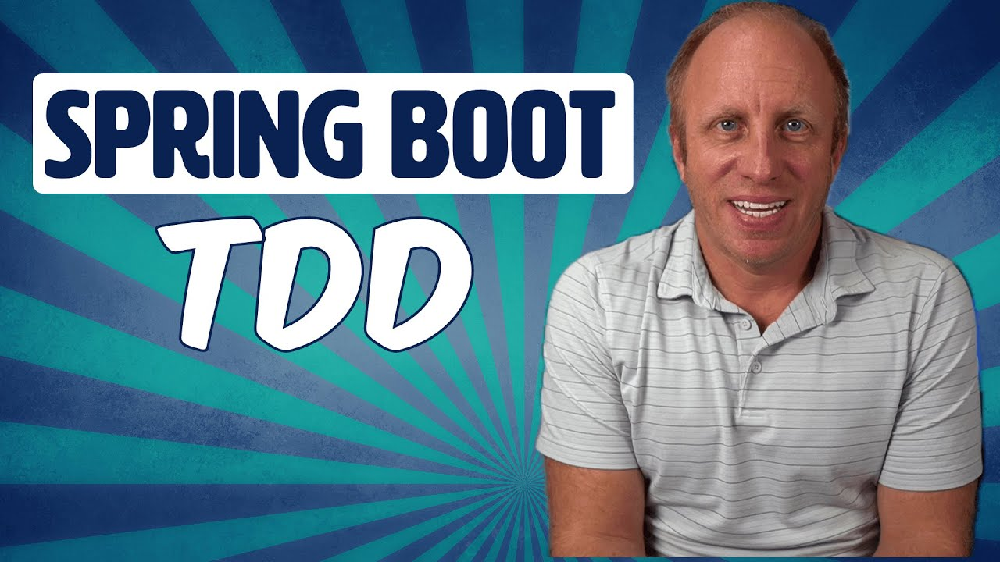

# Spring Boot Project

This is a Rest API project and the initial code is based on the tutorial from [Dan Vega](https://www.youtube.com/@DanVega) called [**Test Driven Development (TDD) in Spring**](https://youtube.com/watch?v=-H5sud1-K5A).
I have made  make my own modifications and improvements (i.e, add new features).

## Project File Structure

@TODO

## Running the application

@TODO

## References

- [**Spring Boot**](https://spring.io/projects/spring-boot)
- [**MDN Web Docs**](https://developer.mozilla.org/)
- [**IntelliJ IDEA Community Edition**](https://www.jetbrains.com/idea/download/?section=linux)
- [**Docker**](https://www.docker.com/)
- [**{JSON} Placeholder**](https://jsonplaceholder.typicode.com/)